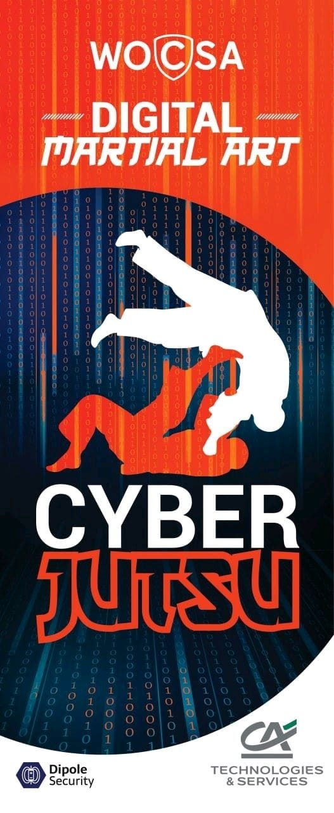

# Cyberjūtsu サイバー術
Cyberjūtsu is a new way to teach cybersecurity inspired from modern japanese martial arts way 武道 (Budō).

Register to http://cyberjutsu.education for bootcamps or stages.

## What is cyberjūtsu ?

Cyberjūtsu is a new way to teach cybersecurity inspired from modern japanese martial arts trainings (mostly judo, karate and jujitsu). It is an educational way which allows everyone (novice to expert) to practice together and improve themselves in cybersecurity through sparring. It follows budō 武道 (judo, jujitsu, karate...) principles and moral code similar to them. The goal is to reach "maximum-efficient use of body, mind and computer" in a "mutual benefit" of a human confrontation.

## Why do we apply martial arts to cybersecurity?

Martial Arts known benefits:
* Improve coordination between mind and movements. 
* Train to act in stressing situations. 
* Develop fast and accurate reflexes. 
* Learn to improvise in unfamiliar events. 
* Teach a code of conduct. Learn to respect others. 
  
There are plenty of other reasons.

