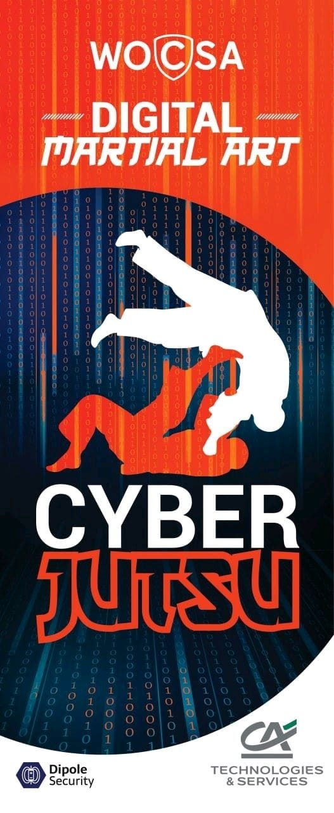

The cyberjutsuka before practicing with someone greet him with physical bow
called Ritsu [Rei](./glossary.md#rei) or "Onegaishimasu" sentence

# Warmup

Eyes

look at top right, bottom left, bottom right, top left (x5)

## draw a circle with your Eyes both sens (x5)

draw an infinity sign with your eyes (∞) (x5)

## Hands

Roll your fingers one by one forward and backward both hands (x5)

* touch with thumb each of your fingers both hands foreward and backward (x2)
* join same finger of each hand with the other, then dismiss couple one by one
forward and backward (x2)
* listen to Sensei number (1 to 5) and dismiss related fingers
* Combined
* with partner tori move fingers, uke must follow with the eyes

Yomi Waza
