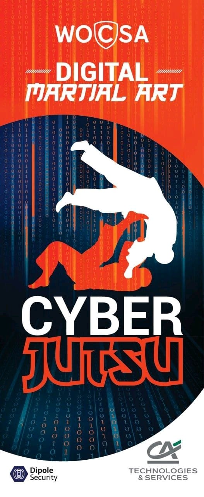

French Translation of '[English](/) | [French](/langs/fr_FR/) |
[Japanese](/langs/ja_JP/)'

# French Translation of 'Cyberjūtsu サイバー術'

Cyberjūtsu is a new way to teach cybersecurity inspired from modern japanese
martial arts way 武道 (Budō).

French Translation of 'Register to http://cyberjutsu.education for bootcamps or
stages.'

## French Translation of 'What is cyberjūtsu ?'

Cyberjūtsu is a new way to teach cybersecurity inspired from modern japanese
martial arts trainings (mostly judo, karate and jujitsu). It is an educational
way which allows everyone (novice to expert) to practice together and improve
themselves in cybersecurity through sparring. It follows budō 武道 (judo, jujitsu,
karate...) principles and moral code similar to them. The goal is to reach
"maximum-efficient use of body, mind and computer" in a "mutual benefit" of a
human confrontation.

## French Translation of 'Why do we apply martial arts to cybersecurity?'

French Translation of 'Martial Arts known benefits:'

* French Translation of 'Improve coordination between mind and movements.'
* French Translation of 'Train to act in stressing situations.'
* French Translation of 'Develop fast and accurate reflexes.'
* French Translation of 'Learn to improvise in unfamiliar events.'
* French Translation of 'Teach a code of conduct. Learn to respect others.'

French Translation of 'There are plenty of other reasons.'
