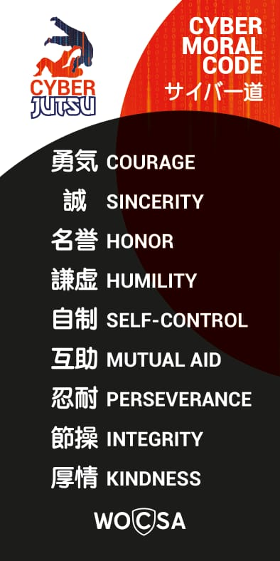

# Cyber Moral Code (Saibā-dō) サイバー道

Moral Code describe how practitioner (Saibā-jūtsu-ka) サイバー述家 behave and shape his inner state for practicing Cyberjūtsu (Saibā-jūtsu)サイバー述.

## Courage (Yuki) 勇気

    勇 “Yuu” means “courage” or “bravery”
    気 “Ki” means “spirit", "mind", "atmosphere", "mood”

    To be in the mood of bravery.

## Sincerity (Makato) 誠

    誠 “Makato” means “truth” or “reality”

    To be in the reality and the truth of the moment.
## Etiquette (Reigi) 礼儀
    “Rei” means “ceremony” or “salute”
    “Gi” means “rule", "affair”

    Ceremony matter live it internaly and externaly. 
    Rules that encourage good behavior during the practice with the others and for yourself.
    It's a framework of rituals for the practice of cyberjutsu.
## Honor (Meiyo) 名誉

    “Mei” means “name” or “title”
    “Yo” means “honor", "glory”

    Honor under the name

## Humility ([Kenkyo](https://interculturalwordsensei.org/kenkyo/)) 謙虚 

    “Ken” means “humble" or “humility”
    “Kyo” means “void", "empty"

    Put your ego aside to get along with the others. 

## Self-control (Shisei) 自制

    “Shi” means “self" or “oneself”
    “Sei” means “control”, "rule"

    Control yourself, drive yourself to the moral code

## Mutual Aid (Gojo) 互助

    “Go” means “mutual” or “reciprocal”
    “Jo” means “help”, "assist", "rescue"

    To progress in the way (do) 道 you must help each others in a partnership.

## Perseverance (Nintai) 忍耐

    “Nin” means “endure", “tolerate”
    “Tai” means “enduring” or "withstand"

    To progress in the way (do) 道  you must endure difficulties, tolerate efforts and resist to despair.

## Integrity (Sessō) 節操

    “Sechi” means “honor” or "melody"
    “So” means “fidelity” or "virginity"

    Remaining true to yourself.

## Kindness (Kojo) 厚情

    “Ko” means “kind”
    “Jo” means “emotion”, "feeling", "mercy", "sympathy"

    Be kind to others and yourself.

